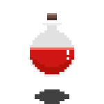
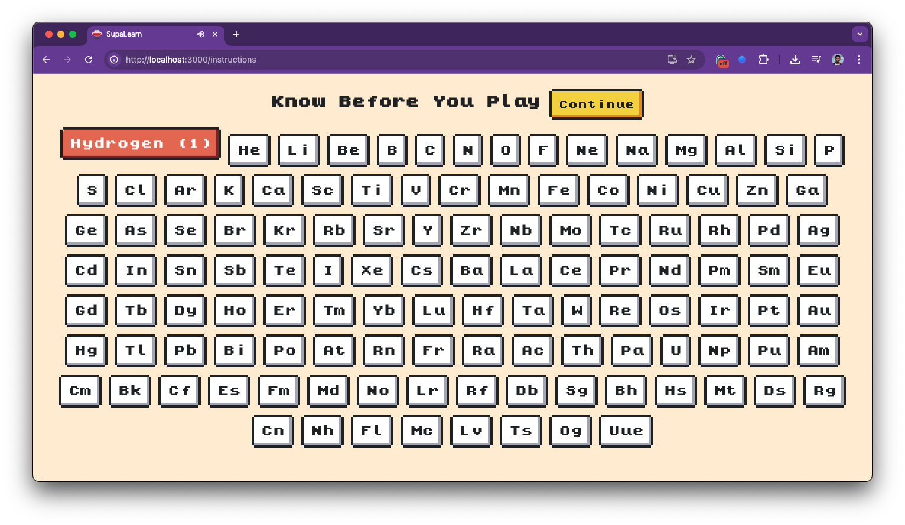
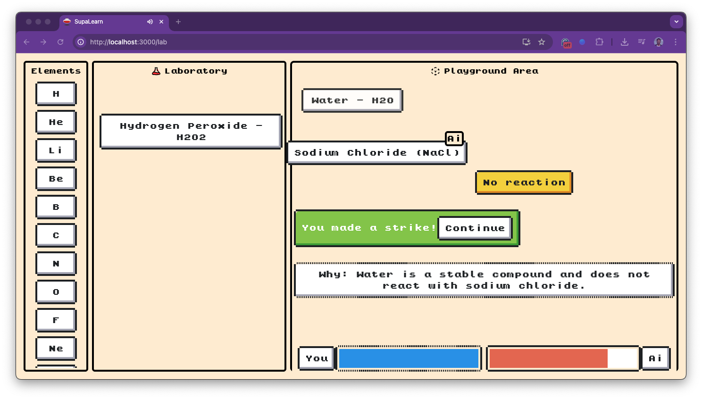

<div align="center">



<h1>SupaLearn</h1>
</div>

SupaLearn is a retro-themed, pixel-style fun app built using **React**, **OpenAI API**, and **Supabase**. This project fuses nostalgic design with cutting-edge AI to deliver playful and intelligent interactions.

## 🧪 Features

- 🎨 **Pixel-Themed UI** – Nostalgic 8-bit inspired design  
- 🤖 **AI-Powered** – Integrates OpenAI for game engine  
- 🗂 **User Auth & Storage** – Supabase for auth, DB, and file storage  
- 🌎 **Periodic Elements** - Learn 118 elements that exists via ai generated audios

## 🛠️ Tech Stack

| Technology | Purpose                     |
|------------|-----------------------------|
| React      | Frontend UI                 |
| OpenAI API | Game Engine                 |
| Supabase   | Auth, database, and storage |
| Nes.css.   | Pixel Styling and layout    |

## 🚀 Getting Started

### 1. Clone the Repo

```bash
git clone https://github.com/imprakashraghu/supalearn.git
cd supalearn
```

### 2. Install Dependencies

```bash
npm install
# or
yarn install
```

### 3. Setup Environment Variables

Create a `.env` file in the root directory:

```env
REACT_APP_OPENAI_KEY=your_openai_api_key
REACT_APP_SUPABASE_URL=your_supabase_url
REACT_APP_SUPABASE_KEY=your_supabase_anon_key
```

> ⚠️ Never expose secret keys in public repositories.

---

## 📸 Screenshots

  
  

---

## 📦 Project Structure

```
src/
│
├── components/     # UI components
├── sounds/         # Sounds
├── fonts/          # Custom Font
└── App.jsx         # Root component
```

---

## 🧑‍💻 Contributing

Contributions are welcome! Open an issue or submit a PR.

```bash
git checkout -b feature/your-feature
git commit -m "Add your awesome feature"
git push origin feature/your-feature
```

---

## 📜 License

MIT License. See [LICENSE](./LICENSE) for more information.

---

## ✨ Acknowledgements

- [OpenAI](https://openai.com/)
- [Supabase](https://supabase.com/)
- [Heroicons](https://heroicons.com/)
- [Nes.css](https://nostalgic-css.github.io/NES.css/)

---

## 📬 Contact

Created by [@imprakashraghu](https://github.com/imprakashraghu) – feel free to reach out!
